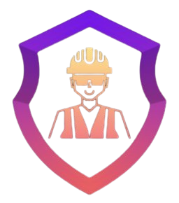

<p align="center">
  
</p>
<h1 align="center">Site Safe AI – Your Site's Third Eye</h1>

---

## Overview

Site Safe AI is an AI-driven system designed to enhance safety compliance on construction sites. Using advanced computer vision techniques and deep learning models, the project detects essential safety equipment like helmets and vests, monitors geofencing zones, and supports face recognition for worker identification. The solution provides real-time monitoring to reduce risks, prevent accidents, and improve compliance with safety regulations.

## Problem Statement

Construction sites are high-risk environments where failure to use proper safety equipment, such as helmets and vests, can result in serious injuries or fatalities. Manual safety monitoring is labor-intensive, error-prone, and often inefficient. Site Safe AI addresses these challenges by automating safety equipment detection, ensuring worker compliance in real-time, and promoting a safer work environment.

## Solution

Site Safe AI leverages the YOLOv8 (You Only Look Once) model for object detection, OpenVINO for optimization, and integrates geofencing and face recognition modules. It processes video footage or images to identify safety equipment, monitor worker locations within defined zones, and recognize faces for access control or attendance. The solution integrates:

- **Computer Vision**: To detect and classify workers' safety gear.
- **Geofencing**: To monitor and enforce virtual boundaries for restricted or hazardous areas on-site.
- **Face Recognition**: For worker identification, attendance, and access control.
- **Real-Time Inference**: To monitor compliance and zone breaches on-site without manual intervention.
- **Performance Optimization**: Using Intel Extension for PyTorch (IPEX) and OpenVINO for maximum efficiency.
- **Post-Processing Alerts**: Notifications via email or SMS when safety violations or geofence breaches are detected.

## Features

- Real-time detection of safety equipment (helmets, vests, etc.).
- Geofencing to define and monitor virtual zones for restricted or hazardous areas.
- Face recognition for worker identification, attendance, and access control.
- Optimized inference using Intel OpenVINO for faster processing.
- Enhanced PyTorch performance with Intel IPEX optimization.
- Alerts for safety violations, geofence breaches, or unauthorized access via email or SMS.
- Scalable architecture for deployment on edge devices or cloud platforms.
- Next.js frontend (`frontend/`) with branding using `frontend/src/assets/logo_bg.png` in the main layout/header.

## Geofencing & Face Recognition

Geofencing and face recognition are included for zone monitoring and worker identification. See `app/geofence/` and `app/services/face_recognition/` for details.

## Dataset

The dataset is sourced from Kaggle: [Construction Site Safety Dataset](https://www.kaggle.com/datasets/snehilsanyal/construction-site-safety-image-dataset-roboflow).

## Technologies Used

- **AI Models and Frameworks**:
  - YOLOv8: Deep learning model for object detection.
  - OpenVINO: Model optimization for faster inference.
  - Intel Extension for PyTorch (IPEX): Performance optimization for PyTorch operations.
- **Backend**:
  - FastAPI
- **Tools and Platforms**:
  - Kaggle for model training and experimentation.
  - OpenVINO Toolkit: For optimizing the YOLOv8 model, enhancing inference performance on Intel hardware.
  - Insight Face: For Face Recognition to enable workerID specific alert system.
- **Frontend**:
  - Next.js 

## Getting Started

### 1. Clone the repository

```bash
git clone https://github.com/Pree46/sitesafeai.git
cd sitesafeai
```

### 2. Install Python dependencies

From the project root:

```bash
pip install -r requirements.txt
```

For face recognition features, set up InsightFace by following:

```text
docs/insightface_setup.md
```

### 3. Run the FastAPI backend

From the project root, start the backend using Uvicorn:

```bash
python -m uvicorn main:app --reload
```

- The API will be available at `http://127.0.0.1:8000`.
- Interactive API docs will be available at `http://127.0.0.1:8000/docs`.

### 4. Run the Next.js frontend

From the project root:

```bash
cd frontend
npm install
npm run dev
```

- The frontend will be available at `http://localhost:3000`.
- Ensure the backend (FastAPI) server is running so the UI can fetch streams, alerts, and analytics.

## Acknowledgements

- Kaggle for providing the Construction Site Safety Dataset.
- Intel OpenVINO for optimization tools.
- YOLOv8 for object detection.

## License

This project is licensed under the **MIT License**. See the `LICENSE` file for details.
```
